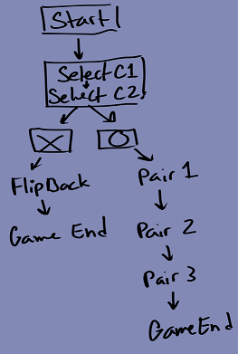

# Nim Mutti –Programming Project

Tile Game

For this Assignment I wanted to create a simple tile game, I wanted this program to include Three key features. 

1.	The program will quickly show the player the cards.

2.	The user will then be able to match the cards.

3.	The user will be able to restart and play again.

Before starting the assignment I came up with a simple model:

I started by cloning BlankNGL by Jon Macey from his Github repository which can be found here (https://github.com/NCCA/BlankNGL). I used this as the base for my program and after some more research found an NGL demo also from Jon Macey on how to use ngl::VAOPrimitives, this can be found here (https://github.com/NCCA/VAOPrimitives). I spent some time reading through this code to figure out how it worked and if there was anything I could use from it. This ended up becoming part of my TileGame Prototype, Which I used to plan out the majority of my functions. I started by loading the cards I needed into the scene and settled on using six cards. Once I had all six cards drawn in and rendered as basic ngl::VAOPrimitives. I started working on my selection functionality soon after this. I started by planning out my picking logic, I had to limit the user to selecting up to two cards per turn. Then I’d need something to check if the cards were matching or different. Next I’d need to choose an appropriate response, if the cards were the same they could be left as they were, however if they were different they’d need to turn back to the face down position, or I could set the game as lost and reset the game loop so the user can try again. I decided to start small by creating two global Booleans to check the status of the turns. I labeled these m_attemptOne and m_attemptTwo. I then created two if statements, the first checking for m_attemptOne == true and the second checking for m_attemptOne == false. These statements were laid out under the impression that if m_attmeptOne was false that it was the users first turn and If m_attemptOne was already true then it was the users second turn as seen below.

Although this seemed to work I needed to create a way for the user to select the cards and for the program to be able to differentiate between the different card upon selecting them. Originally, I planned to use the mouse click to do this, however after attempting to add Raytracing I quickly realized I needed to change my initial plan.

I was unable to get Raytracing Implemented by my personal deadline and to save time I had to come up with a way to combat it. Instead of having the user select card pairs with their mouse, I utilized QKeyEvents(https://doc.qt.io/qt-6/qkeyevent.html) instead. I then created a selector object that would give the user a visual sense of what cards they were selecting and then set up the key-binds to move the selector object behind the positions of the existing cards.

I used the example on how to use both QKeyEvents (BlankNGL Demo) and the example on setting the position of VAO::Primitives (ngl VAO::Primitives Demo) from Jon Macey’s GitHub Page and repositories (as stated before). I used one card to help me set up the logic for the functions that followed. This made it easier for me to read my code, however I needed to keep in mind that eventually there would be 6 or more cards that would all need to have access to the same functions. I created the class cardlist (cardlist.h and cardlist.cpp) to store the main functions and variables I would need to carry out the rest of the project. 

I created a std::unique_ptr for each card and set out to planning and coding my main functionalities. I should have created a std:vector list to store these pointers, however I didn’t do this until much later an ended up having to create an unnecessary amount of if statements to check if my program functionalities actually worked. Once I had created my cards I started on the animations and selection logic. 

I created several voids, Booleans and ints to check the card flip status at multiple stages throughout the code. I did this to prevent bugs such as the user selecting the same card twice, stuck cards etc. For the sake of fool proofing my logic I put the match checkers on hold and used if statements to check temporarily pre-set card pairs. Once I had a working system, I started to develop the actual checkers. Before I could do this, I needed to produce a way to match the pairs. 

I wanted the cards to shuffle every time the user reset the program however, I chose to shuffle the card textures instead of shuffling the actual cards. I loaded in my textures and assigned them as ints in a list using std:vector and named it CardOrder  . This program uses a total of 5 textures. 3 card pairs, the back of the cards and the selector. I numbered these 0-4 in the list. I then binded the texture list position pairs to my existing card pairs and the selector. 

To randomize the textures I used std::shuffle(https://en.cppreference.com/w/cpp/algorithm/random_shuffle) to randomize the order of the texture numbers in the list. 

Now that I had randomly assigned textures I needed to check for pairs at the end of every turn. To do this I checked for the assigned texture in each selected card using CardOrder[X]. Since the positions of the textures in the CardOrder list match the numbers of the cards it was much easier to write these statements then I originally expected. I used if statement and CardOrder[X] to check which texture was assigned to the card. I then used the void setTextureStatus to record the texture number in an int called choiceOnetxt or choiceTwotxt depending on when the card was selected during the turn. I also used another set of variables called card1num and card2num to record the card number. I then created a checker under the condition that the turn was over to check if choiceOnetxt and choiceTwotxt had matching values (0,1 or 2) if the values match then the corresponding boolean is also set to true. If not then there is another check which uses the values from card1num and card2num to flip the mismatching pair in question back to face down. Although I had a set of animations for each card I realized very quickly that it was not very efficient, although the run time was the same it made reading my code very difficult so I decided to place all of the card pointers into a new std::vector called cards. I then change the majority of my largely repeated if statements for the cards into for statements. Similar to the image below.

 For my animations I used the checkers mentioned earlier to set a series of Booleans to true or false, this would trigger for the cards to be flipped either forwards or backwards depending on the status check in question. For example if a pair was false the voids setflipback() and setcardstatus() would be set to true and the cards in question ( all of the cards that are currently face up in the game loop) would be flipped back to being face down so the game can continue. 

When the game loop starts the program shows the user a quick peak of the cards, this is controlled by the TAB and r Keys. To create the small pause in the animation I had to create a timer that would count the pause gap and allow me to “pause” my code. What this really does is allow me to delay when a conditioning Boolean is set to false so the next animation can play (in this case flipping the card back over to face down) These keys also reset all of the initializing variables for the gameplay to be set back to zero so the user can have a clean reset. 

If I had the chance to work on this program more, I would try to implement a menu and a UI, I would also arrange the cards better and possible add higher difficulties. 

The program runs as follows:

Program initializes.

User uses the TAB or R keys to start the game loop.

The program quickly shows the user the placement of the cards before flipping them back over.

The user is then able to select two cards per turn. 

If their selections are correct, the cards will remain visible. If the selections are false, the cards will flip back over. The user will then be able to continue matching cards until they complete the game (get all the pairs) and then they can either choose to play again using the TAB/R keys to reset the game or stop playing and exit the program. The user can reset the program at any time using the same reset keys. Every time the game is reset the placements of the cards are also randomly generated again.

The following are images of the Game Play:

